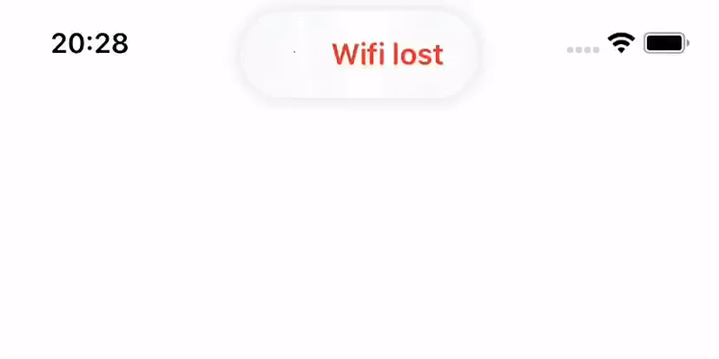

<p align="center">
	
</p>

<p align="center">
    
    <a href="https://swift.org/package-manager">
        
    </a>
     
    <a href="https://twitter.com/gianpispi">
        
    </a>
</p>

#### Lightweight iOS 13 badge like with ease.

## Features
- Highly customizable ✅
- iPhone, iPhone X, & iPad Support ✅
- Orientation change support ✅
- Haptic feeback support ✅

## Requirements

 - iOS 10.0+
 - Xcode 10.0+

## Installation

### Carthage

In order to use Banner via Carthage simply add this line to your `Cartfile`:

#### Swift 5
```swift
github "gianpispi/Banner"
```
Then add `Banner.framework` in your project.

### Swift Package Manager

The [Swift Package Manager](https://swift.org/package-manager/) is a tool for automating the distribution of Swift code and is integrated into the `swift` compiler.

Once you have your Swift package set up, adding Banner as a dependency is as easy as adding it to the `dependencies` value of your `Package.swift`.

```swift
dependencies: [
.package(url: "https://github.com/gianpispi/Banner.git", from: "1.0.0")
]
```


## Usage

Creating banners is simple as this:

```swift
let settings = BannerSettings(icon: UIImage(systemName: "checkmark.seal.fill", withConfiguration: UIImage.SymbolConfiguration(weight: .semibold)), title: "It works")
Banner.show(withSettings: settings)
```

If you want to change the tint color of the banner, just use the `tintColor` value in the BannerSettings declaration as follows:

```swift
let settings = BannerSettings(icon: UIImage(systemName: "checkmark.seal.fill", withConfiguration: UIImage.SymbolConfiguration(weight: .semibold)), title: "It works", tintColor: .red)
Banner.show(withSettings: settings)
```

To change the background blur effect, add the `backgroundStyle`:

```swift
let settings = BannerSettings(icon: UIImage(systemName: "checkmark.seal.fill", withConfiguration: UIImage.SymbolConfiguration(weight: .semibold)), title: "It works", backgroundStyle: .dark)
Banner.show(withSettings: settings)
```

You can even change the dismissMode, which can be `.never`, `automatic` or `.custom(seconds: 2)`. By default it uses the automatic.

```swift
let settings = BannerSettings(icon: UIImage(systemName: "checkmark.seal.fill", withConfiguration: UIImage.SymbolConfiguration(weight: .semibold)), title: "It works", dismissMode: .never)
Banner.show(withSettings: settings)
```


## Haptic Feedback Support
You can also set a haptic feedback when the banner shows up. By default, no haptic feedback will be generated. The types of haptic feedback are as follows:

```swift
public enum HapticStyle {
    case notificationError
    case notificationWarning
    case notificationSuccess
    
    case light
    case medium
    case heavy
    case none
    
    case soft
    case rigid
}
```

To change the style of haptic feedback, simply declare it in the BannerSettings initialization:

```swift
let settings = BannerSettings(icon: UIImage(systemName: "checkmark.seal.fill"), title: "It works", backgroundStyle: .systemChromeMaterial, dismissMode: .automatic, hapticStyle: .notificationSuccess)
```

## Feature Requests
I'd love to know improve Banner as much as I can. Feel free to open an issue and I'll do everything I can to accomodate that request if it is in the library's best interest. Or just create a pull request and I'll check it out. 

## Author
Gianpiero Spinelli, gianpiero@grspinelli.it

## License
Banner is available under the MIT license. See the LICENSE file for more info.
